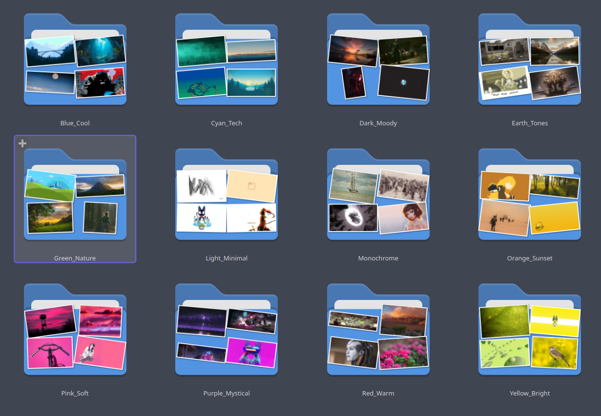

# wallpaper-utils

- [TLDR](#tldr)
- [Group Wallpapers](#group-wallpapers) by [Color Groups](#color-groups)
- [Validate Images](#validate-images)
- [Change Wallpaper Based on Time of Day (Night Time = Dark Image, Day Time = Bright Image)](#change-wallpapers-based-on-time-of-day)
- [Create Color Palette From Image](#create-color-palette-from-image)

## Requirements

- make
- clang++
- OpenCV (libopencv)
- [argparse](https://github.com/p-ranav/argparse)

## Build & Install

```bash
make all
sudo make install
```

## TLDR

```bash
# Recursevly validate images in dir (find corrupt images). Test if they can be loaded. Delete with -d, Move with -m
./wpu-validator -i <dir>

# Group images by color groups below.
./wpu-grouper -i <input_dir> -o <output_dir> --copy

# Give darkness score for images and write to csv, sort output.
./wpu-darkscore -i <input_dir> -o wpu-darkscore_output.csv --sort

# Read the previous file and set wallpaper based on time of day, -e execute, -l loop logic, -d deamonize
./wpu-darkscore-select -i wpu-darkscore_output.csv -e plasma-apply-wallpaperimage -l -d

# Show most dominant colors in image and make a color palette.
./wpu-palette <file.png/jpg/...>
```

---

## Group Wallpapers

```console
wpu-grouper --help
```

### Color Groups

| Name            | Hue Min | Hue Max | Sat Min | Sat Max | Bright Min | Bright Max | Representative Color (B, G, R) |
| --------------- | ------- | ------- | ------- | ------- | ---------- | ---------- | ------------------------------ |
| Blue_Cool       | 200     | 260     | 0.3     | 1.0     | 0.3        | 1.0        | (255, 100, 50)                 |
| Red_Warm        | 340     | 20      | 0.3     | 1.0     | 0.3        | 1.0        | (50, 50, 255)                  |
| Green_Nature    | 80      | 140     | 0.3     | 1.0     | 0.3        | 1.0        | (50, 255, 100)                 |
| Orange_Sunset   | 20      | 50      | 0.4     | 1.0     | 0.4        | 1.0        | (50, 165, 255)                 |
| Purple_Mystical | 260     | 300     | 0.3     | 1.0     | 0.3        | 1.0        | (255, 50, 200)                 |
| Yellow_Bright   | 50      | 80      | 0.4     | 1.0     | 0.5        | 1.0        | (50, 255, 255)                 |
| Pink_Soft       | 300     | 340     | 0.3     | 1.0     | 0.4        | 1.0        | (200, 100, 255)                |
| Cyan_Tech       | 160     | 200     | 0.4     | 1.0     | 0.4        | 1.0        | (255, 200, 100)                |
| Dark_Moody      | 0       | 360     | 0.0     | 1.0     | 0.0        | 0.25       | (40, 40, 40)                   |
| Light_Minimal   | 0       | 360     | 0.0     | 0.3     | 0.8        | 1.0        | (240, 240, 240)                |
| Monochrome      | 0       | 360     | 0.0     | 0.15    | 0.25       | 0.8        | (128, 128, 128)                |
| Earth_Tones     | 25      | 45      | 0.2     | 0.7     | 0.3        | 0.7        | (100, 150, 200)                |



<details><summary>Usage</summary>

```console
Usage: grouper [--help] [--version] --input VAR [--output VAR] [[--copy]|[--move]] [--algorithm 0/1/2]

group wallpapers by color palette

Optional arguments:
  -h, --help       shows help message and exits
  -v, --version    prints version information and exits

Required (detailed usage):
  -i, --input      input folder [required]

Optional (detailed usage):
  -o, --output     output folder (if not speicifed files won't be moved/copied, must specify --copy or --move to do action)
  -c, --copy       copy files to output dir
  -m, --move       move files to output dir
  -a, --algorithm  which algorithm to use when grouping images (KMeans = 0, KMeansOptimized = 1, Histogram = 2 [nargs=0..1] [default: 0]
```

</details>

## Change Wallpapers Based on Time of Day

### Workflow

```bash
# create csv file that will hold absolute file paths to images
# and their darkness scores (/abs/file/path|darkness score)
# --sort descending order
./wpu-darkscore -i <input_dir> -o wpu-darkscore_output.csv --sort

# read from that csv file and create 6 buckets
# (very dark, dark, mid-dark, mid-bright, bright, very bright)
# shuffle buckets
# -l loops logic and checks current hour from datetime
#    * the hour tells the program which bucket to use when choosing wallpaper
# -d tells program to run in background (daemonize)
# it reshuffles when:
#   * after looping through the entire bucket
#   * if bucket changes (hour changes)
./wpu-darkscore-select -i wpu-darkscore_output.csv -e plasma-apply-wallpaperimage -l -d
```

<details><summary>Usages</summary>

```console
Usage: darkscore [--help] [--version] --input VAR --output VAR [--sortd] [--sorta]

give darkness score for wallpapers

Optional arguments:
  -h, --help                shows help message and exits
  -v, --version             prints version information and exits
  -i, --input               Path to a image file or folder containing images (recursive) [required]
  -o, --output              Path to output CSV file [required]
  -s, -sd, --sort, --sortd  Sort output by darkness score descending order
  -sa, --sorta              Sort output by darkness score ascending order

```

```console
Usage: darkscore-select [--help] [--version] --input file.csv [--exec command] [--daemon] [--loop] [--sleep sleep_ms]

select wallpaper from csv file based on time of day and darkness score (night = dark, day = bright)

Optional arguments:
  -h, --help            shows help message and exits
  -v, --version         prints version information and exits
  -i, --input file.csv  csv file that was made by wpu-darkscore [required]
  -e, --exec            pass image to a command and execute (e.g. plasma-apply-wallpaperimage) [nargs=0..1] [default: ""]
  -d, --daemon          run daemon in the background
  -l, --loop            loop logic for setting wallpapers
  -s, --sleep           sleep ms for loop [nargs=0..1] [default: 60000]

```

##### Notes:

```bash
# You can change wallpaper on enter
# or sending a signal (useful when running as a daemon (-d)) with:
pkill -RTMIN+10 -f wpu-darkscore-select
```

##### also check out these useful [scripts](https://github.com/0000xFFFF/wallpaper-utils/tree/master/scripts)

</details>

---

## Validate Images

### Examples

```bash
./wpu-validator -i wallpapers -d      # delete corrupt images in wallpapers dir
./wpu-validator -i wallpapers -m      # move corrupt images to corrupted_images
```

<details><summary>Usage</summary>

```console
Usage: validator [--help] [--version] --input VAR [--move] [--delete] [--prompt]

validate images, find corrupt images (and delete them/move them/etc)

Optional arguments:
  -h, --help     shows help message and exits
  -v, --version  prints version information and exits
  -i, --input    Path to a image file or folder containing images (recursive) [required]
  -m, --move     move corrupt files to corrupted_images folder (make one)
  -d, --delete   delete corrupt files
  -p, --prompt   prompt what to do after scanning (nothing/delete/move)
```

</details>

---

## Create Color Palette From Image

```console
./wpu-palette <file.png/jpg/...> [num colors]
```
